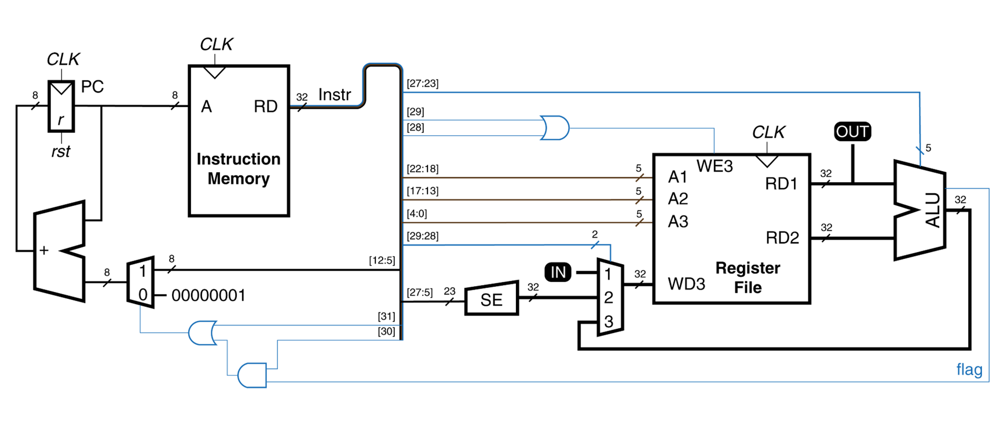
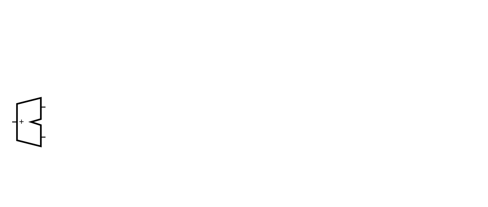
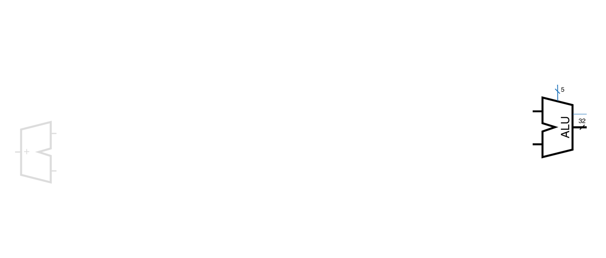
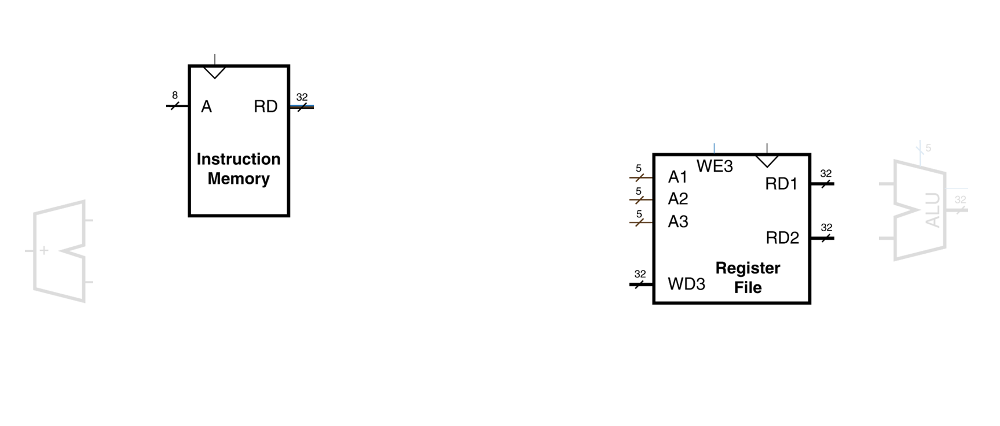
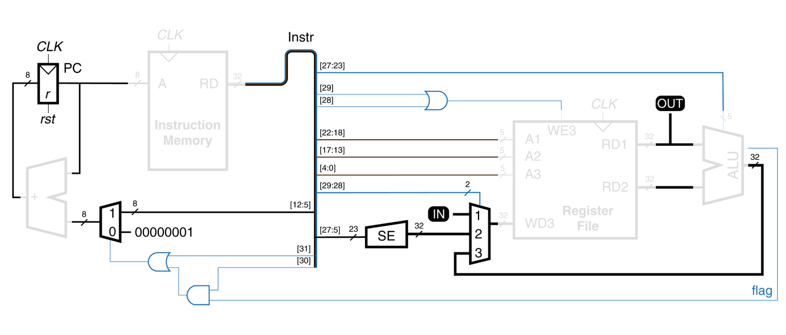

# Цикл лабораторных работ курса "Архитектуры процессорных систем"

## Обзор лабораторных работ

Курс *Архитектур процессорных систем* включает в себя цикл из 4 лабораторных работ, в течение которых используя язык описания аппаратуры **Verilog HDL** на основе **FPGA** (ПЛИС, программируемая логическая интегральная схема), с нуля, последовательно, создается программируемое устройство – процессор.

## 1. Сумматор. Verilog HDL (Adder)
На первой лабораторной работе изучаются базовые конструкции языка описания аппаратуры Verilog HDL, с помощью которого разрабатывается цифровой сумматор из примитивных логических вентилей, который, в последствии, конфигурируется в ПЛИС и его работа проверяется на отладочном стенде.

## 2. Арифметико-логическое устройство (ALU)
На второй лабораторной изучаются новые конструкции языка Verilog HDL, на основе которых разрабатывается блок арифметико-логического устройства (АЛУ). АЛУ - это устройство, на входы которого подаются операнды, над которыми нужно выполнить некоторую операцию (сложение, вычитание и тому подобное) и код операции, которую нужно выполнить, а на выходе появляется результат этой операции. Проще говоря АЛУ - это "калькулятор" процессора.

Для проверки правильной работоспособности АЛУ на языке Verilog HDL пишется testbench (тестовое окружение), которое автоматически проверяет корректность его реализации.

## 3. Регистровый файл и память (RF)
На третьей лабораторной разрабатываются элементы памяти для будущего процессора: память команд и регистровый файл. В памяти команд будет храниться программа, которую будет выполнять процессор. Регистровый файл - это маленькая память с данными, которые могут быть поданы непосредственно на АЛУ.

## 4. Простейшее программируемое устройство (PPD)
В рамках четвертой лабораторной работы из реализованных блоков собирается программируемое устройство с архитектурой `CYBERcobra 3000 Pro 2.0`, для которого пишется программа в машинных кодах, а результат запускается и проверяется на отладочном стенде с ПЛИС.

